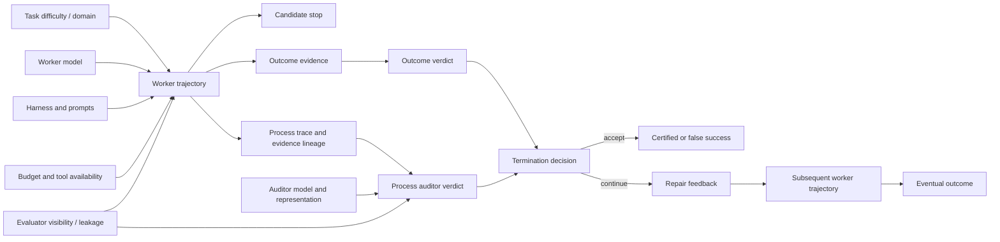

# Causal Model — Draft

## Main causal question

Under a fixed task distribution, worker model, harness, tool set, environment, and resource policy, what is the effect of adding Process-Certified Termination on exit calibration, repair, and certified task success?

## Treatment

Presence and configuration of the PCT layer, including representation, auditor, evidence policy, feedback, and termination controller.

## Primary outcome

Termination calibration: False Accept reduction with False Continue constrained by a preregistered non-inferiority margin.

## Secondary outcomes

- Repair Conversion;
- Certified Success;
- Corrupt Success detection;
- First Invalid Transition localization;
- cost to certified success;
- no-progress and human-escalation quality.

## Important confounders and controls

- worker model/version;
- harness commit and system prompt;
- task instance and initial environment;
- tool visibility and permissions;
- token, time, and tool-call budgets;
- evaluator information available to each condition;
- auditor model and test-time compute;
- randomness and repeated-run index.

## Key mediators

- process representation quality;
- evidence coverage and freshness;
- auditor verdict accuracy;
- feedback localization quality;
- number of additional repair turns.

## Competing explanations to test

1. improvement comes only from extra compute;
2. improvement comes only from a stronger second model;
3. improvement comes from hidden evaluator leakage;
4. improvement is specific to DeepSeek Harness's current loop;
5. the method merely becomes more conservative, lowering both accepts and useful completion;
6. structured feedback helps because it is longer, not because it localizes process errors.
